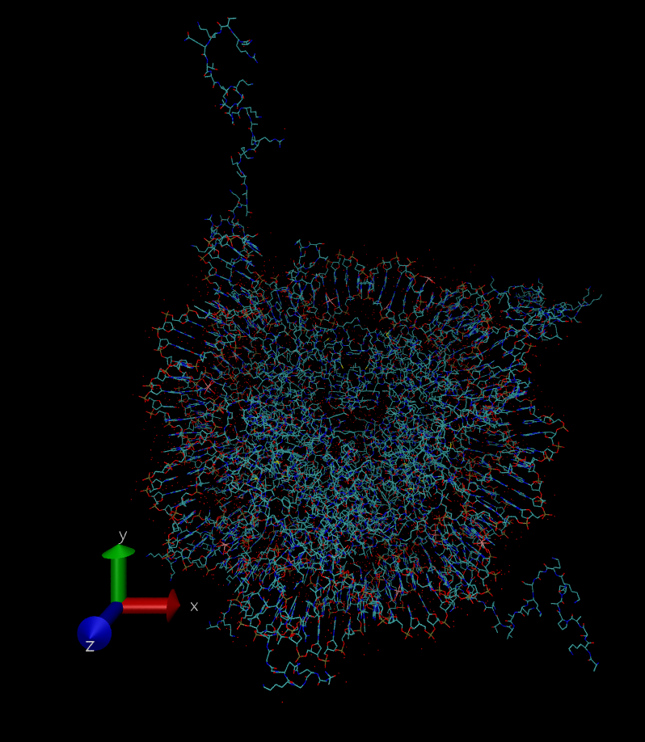
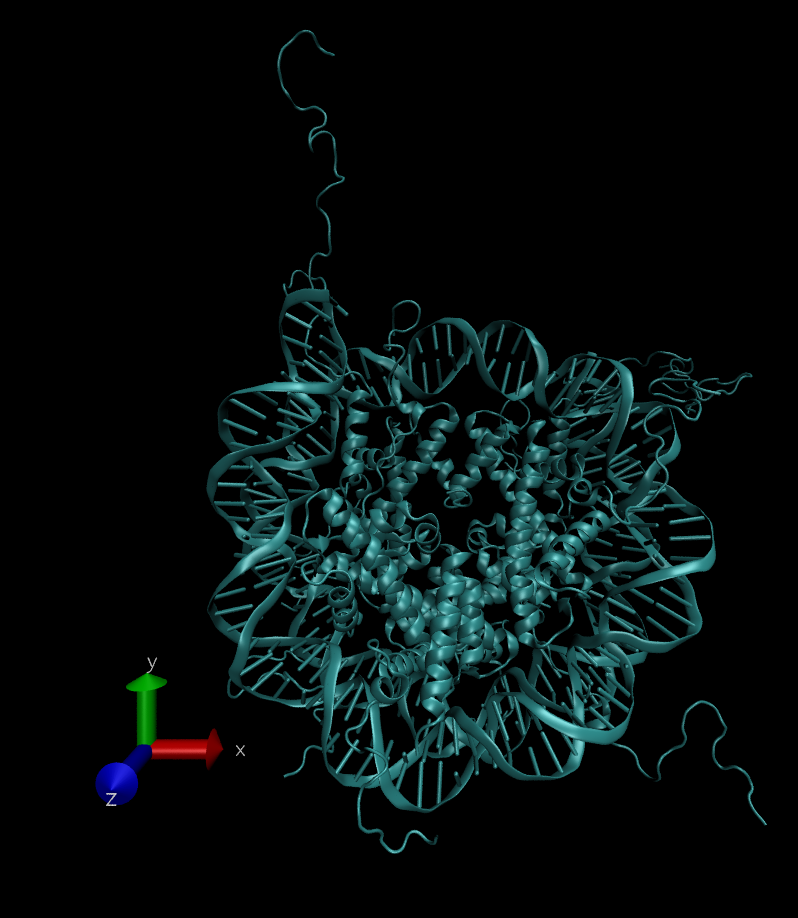
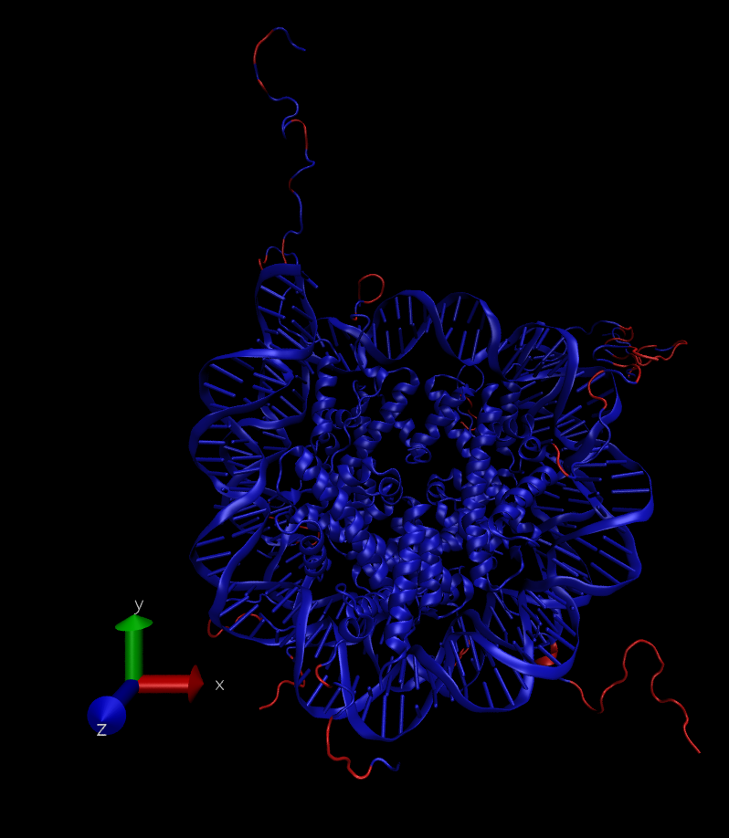
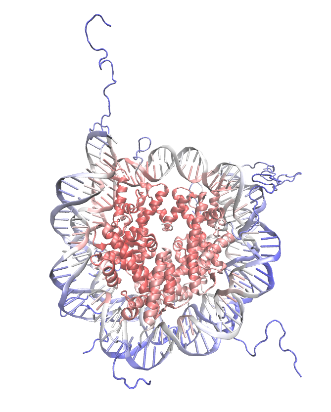
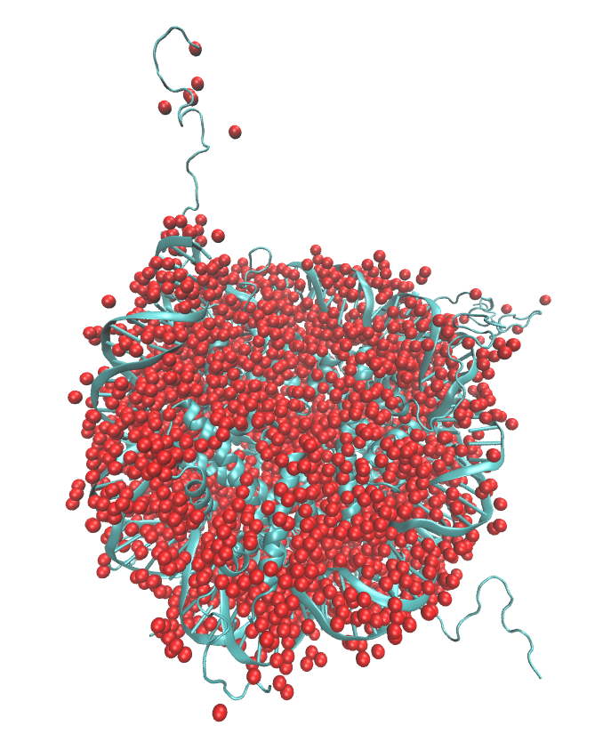
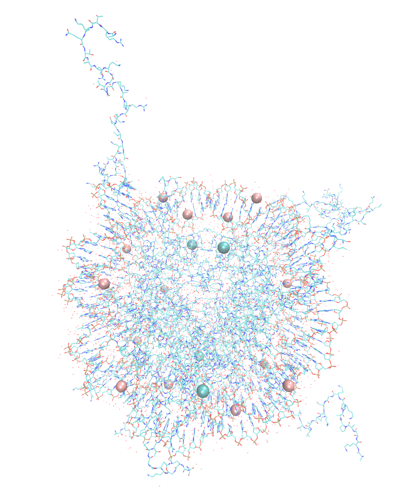

# Tutorial on simulating molecular dynamics of a nucleosome core particle in Gromacs
## Directory structure
[docs](docs) - documentation for the current tutorial  
[prep](prep) - scripts to prepare the structure for simulations  
[simul](simul) - directory to perform simulations  
[analysis](analysis) - scripts to perform trajectory analysis  

## Contents
1. [**Introduction**](#Introduction) 
   + [Objectives](#Objectives)
   + [Prerequisites](#Prerequisites)
   + [Hardware/Software requirements](#Hardware)
   + [Reference materials and further reading](#Reference_materials)
      + [Manuals and CheatCheets](#Manuals)
      + [Textbooks](#Textbooks)
      + [Other useful tutorials](#Other_tutorials)
2. [**System description and simulation strategy choice**](#System)
   + [Nucleosome core particle and its PDB structures](#NCP)
   + [Understanding your PDB structure](#Understanding_PDB)
   + [Dealing with flexible histone tails](#H_tails)
   + [Ionic conditions and choosing simulation box size](#Ions_box)
   + [Force field choice](#ForceField)
3. [**Installing software**](#installing_soft)
4. [**Obtaining force field files**](#Obtaining_FF_files)
5. [**Pereparing system for simulation**](#before_stimulation)
      

<a name="Introduction"/>

## 1. Introduction
This tutorial introduces students to molecular dynamics simulations method using GROMACS by the example of simulating the nucleosome core particle. 

<a name="Objectives"/>

### Objectives

- To gain an understanding of Molecular Dynamics Simulations method;
- To learn how to prepare a molecular system for MD simulations from a PDB file;
- To understand how to choose ForceField and correct stimulation conditions;
- To learn how to run MD simulations using GROMACS on a parallel computer cluster;
- To learn how to visualize and analyze MD trajectories;
- To provide a reusable set of scripts and examples that students may reuse to simulate the system of interest.

<a name="Prerequisites"/>

### Prerequisites
Basic knowledge of the following areas is required:
- Unix-like Operating System (e.g. Linux), recommended tutorial [here](http://swcarpentry.github.io/shell-novice/);
- Terminal / Command line interface and Bash scripting, recommended tutorial [here](http://swcarpentry.github.io/shell-novice/); 
- Basic Physical Chemistry and Biochemistry;
- PDB file structure, recommended tutorial [here](https://pdb101.rcsb.org/learn/guide-to-understanding-pdb-data/introduction)

<a name="Hardware"/>

### Hardware/Software requirements for the tutorial
- Access to a Linux machine, ideally Ubuntu;
- Gromacs v. 5.1, [intallations instructions](http://www.gromacs.org/Downloads/Installation_Instructions);
- VMD v. 1.9.4, [intallations instructions](https://www.biostars.org/p/196147/);
- Chimera v. 1.13, [intallations instructions](http://www.cgl.ucsf.edu/chimera/download.html);
- Anaconda Python, [intallations instructions](https://docs.anaconda.com/anaconda/install/);
...

<a name="Reference_materials"/>

### Reference materials and further reading

<a name="Manuals"/>

#### Manuals and CheatCheets
- Bash CheatSheet [[1]](https://gist.github.com/LeCoupa/122b12050f5fb267e75f) or [[2]](https://devhints.io/bash)
- [GROMACS manual](http://ftp.gromacs.org/pub/manual/manual-5.0.4.pdf)

<a name="Textbooks"/>

#### Textbooks 

- [Computer Simulation of Liquids](https://books.google.ru/books/about/Computer_Simulation_of_Liquids.html?id=O32VXB9e5P4C&redir_esc=y), Allen and Tildesley, 1989
- [Understanding Molecula Dynamics](https://www.sciencedirect.com/science/book/9780122673511), Frenkel and Smith, 2002
- [Molecular Driving Forces](https://books.google.ru/books/about/Molecular_Driving_Forces.html?id=hdeODhjp1bUC&redir_esc=y), Dill, 2003 
- [Intermolecular and Surface forces](https://www.sciencedirect.com/science/book/9780123751829), Israelachvili, 1985

<a name="Other_tutorials"/>

#### Other useful tutorials

- Quick and easy tutorial [Lysozyme in Water](http://www.bevanlab.biochem.vt.edu/Pages/Personal/justin/gmx-tutorials/lysozyme/index.html)

<a name="System"/>

## 2. System description and simulation strategy choice

<a name="NCP"/>

### Nucleosome core particle and its PDB structures
Nucleosome is a basic unit of DNA package in eukaryotes. 
Nuclosome Core particle (NCP) consists of 1.67 left-handed super-helical turns of DNA around an octamer of histone proteins. NCP contains 145-147 bp of DNA. The octamer consists of 2 copies each of the core histones H2A, H2B, H3, and H4. 

  *Further information about various NCP structures by X-Ray ([Nucleosome structural studies,](https://www.ncbi.nlm.nih.gov/pubmed/21176878), Davey, 2011)*

In this tutorial we are going to use 1KX5 PDB structure. You can try to find it on RSCB PDB by yourself or download from this [link](https://www.rcsb.org/structure/1kx5). We have chosen this structure because it has the best resolution - 1.94 A.  

We can 
[Check](https://pdb101.rcsb.org/learn/guide-to-understanding-pdb-data/resolution) what kind of problems you will get if you choose the structure with wrong resolution. The quality of the starting structure is essential for the whole analyzis. It should be choosen very carefully. 

  *Further information of the resolution of the crystall structures ([Protein crystallography for non-cristallographers](https://www.ncbi.nlm.nih.gov/pubmed/18034855), Wlodawer A., 2008)*

<a name="Understanding_PDB"/>

### Understanding your PDB structure 

In this tutorial we are going to work mostly with VMD. Consequently, it should be added to the PATH. See [here]() how to do it (закончить). 

Open your PDB structure in VMD using this command in command line
Make sure you are in the exact directory where 1kx5.pdb was downloaded. Then type:
> VMD 1kx5.pdb

Then you will see this:

*Fig.1. VMD presentation of the molecule*

The background was changed from black to white for better representation. It is not necessary for you. When you open your system in VMD the background is automaticaly black. Axes were also deleted.

For better and more understandable view open in VMD Main window:
> Graphics > Representations  

A new window called "Graphical Representation" will be opened. Then choose:
> Drawing method > NewCartoon 

You will see this: 

<a name="fig2"/>

*Fig.2. NewCartoon Drawing Method*

**Coloring by occupancy and B-factor**. 

At first, we need to understand what are occupancy and B-factor. 

Macromolecule crystall consists of many individual molecules. These molecules are packed into a symmetrical unit. In some crystalls there are slight conformational differences between the molecules. Scienmtist use the *occupancy* to estimate the amount of each conformation that is observed in the crystal. 

In the same window ("Graphical Representation"):
> Coloring Method > Occupancy

*Fig.3. Coloring by the Occupancy*

Zero occupancy meaans that these parts of the structure was completed by computer programs and were not observed experimentally. 
*CAUTION! You should always read the original article of the structure you use.*

*B-factor* (often refered to as atomic displacement parameter/*The Debye–Waller factor (DWF)*/temperature factor) monitors the positional spread of each atom. It describes the displacement of the atomic positions from an average (mean) value. Lower resolution tends to correlate with high B-factor. 
The formula for the B-factor is: 

 B = 8\pi^2 \langle u^2 \rangle
 
 It is measured in units of Å^2.

The B-factors can be taken as indicating the relative vibrational motion of different parts of the structure. Atoms with low B-factors belong to a part of the structure that is well ordered. Atoms with large B-factors generally belong to part of the structure that is very flexible.

For coloring by B-factor choose:
> Coloring Method > Beta

*Fig.4. Coloring by B-factor*

In this picture blue is an area with low B-factor. It means that these areas are more flexible than red ones. Consequently, atomic positions are less accurate in these zones. 

**DNA, Protein, Water and Ions**

Let's get back to the [Fig.2](#fig2) state with NewCartoon Drawing method. Now we're going to explore other molecules inside this system. We're going to start from water molecules. 

We are still working with Graphical Representation window.
First, you need to Create Rep. Tap on it and type "water" in Selected Atoms. Coloring method is VDW which is Van-der-Waals. You will see this:

*Fig.5. Showing water molecules*

The high resolution of this structure has allowed to define the location of bound water. In the articles with lower resolution this would be inpossible, but it doesn't mean that there is no bound water in it, it is just not defined. 

You will do the same to see the Ions except typing "ions" in Selected Atoms.

*Fig.6. Showing ions*

Not only Na, K and Cl but heavy ions like are often used for proper protein crystallization. These usually divalent ions are very difficult for dynamics because they can polarize the space around them which leads to changes in water localization. 

You can also choose DNA or protein the same way as described earlier. Now  you know how to understand your PDB system.

**The next step is to understand should we change water and ions condition**

So, at first we will remain the bound water. 
Then you need to check the ions through VMD program or by reading the .pdb file. Once you have noticed ions you need to decide leave them or delete. 
In the chosen structure there are only Mn and Cl. Mn is divalent ions, consequently, it should be deleted because of the reasons showed above. Cl is not divalent, it is located in the places of high positive potential, so we are going to leave it. 

Then you need to check the **side chain conformation**. 

наличие связанной воды - удалять или не удалять, как затем достраивать атомы водорода
разные ионы - что с ними делать

<a name="H_tails"/>

### Dealing with flexible histone tails

<a name="Ions_box"/>

### Ionic conditions and choosing simulation box size

<a name="ForceField"/>

### Force field choice

Ion parameters chosen as [(Yoo & Aksiementiev, JPC, 2012)](https://pubs.acs.org/doi/abs/10.1021/jz201501a)

<a name="installing_soft"/>

## 3. Installing software

<a name="Obtaining_FF_files"/>

## 4. Obtaining force field files

<a name="before_stimulation"/>

## 5. Pereparing system for simulation

