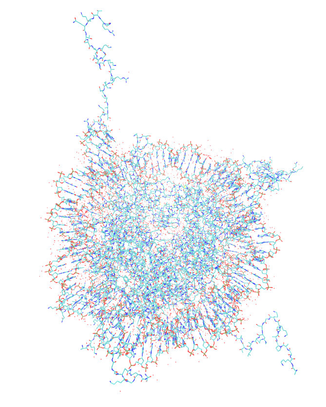
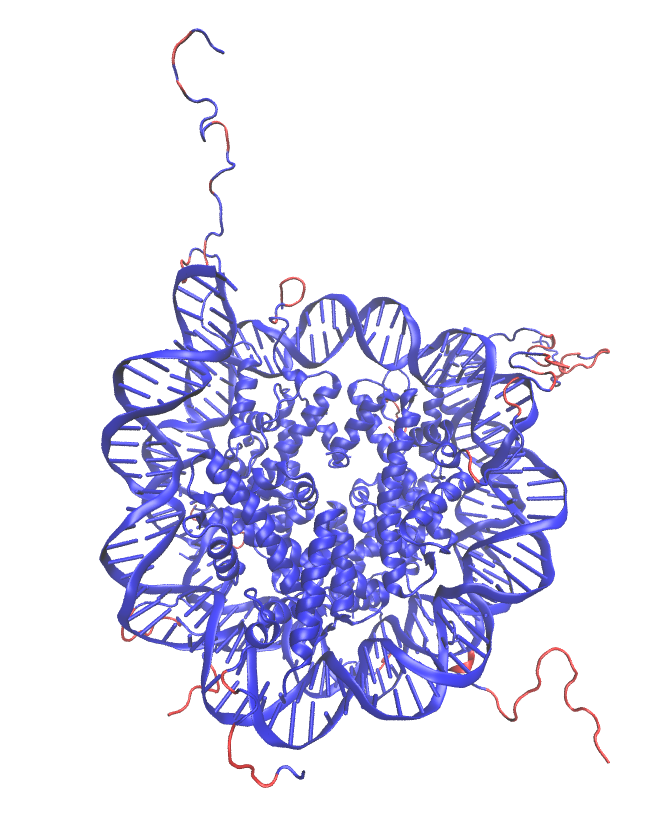
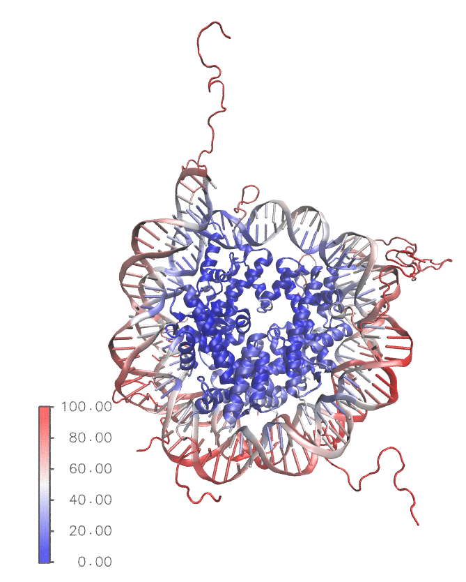
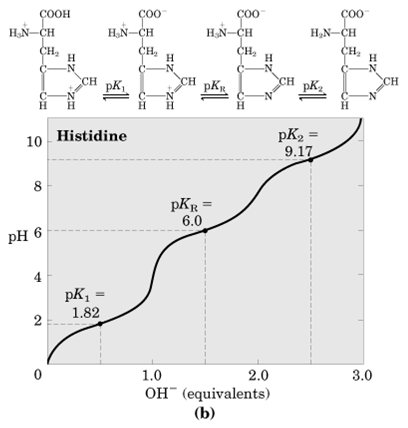
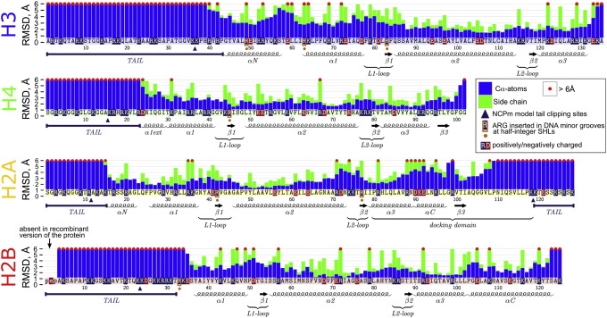
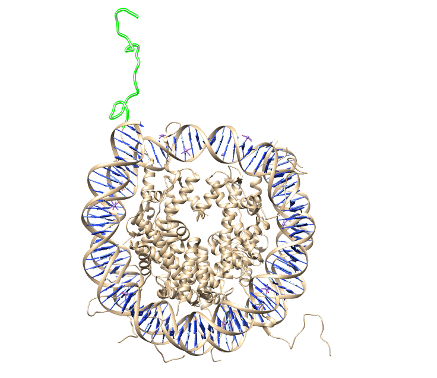
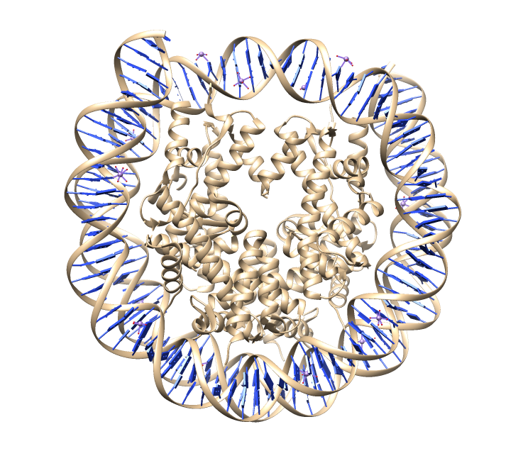

# Tutorial on simulating molecular dynamics of a nucleosome core particle in Gromacs
## Directory structure
[docs](docs) - documentation for the current tutorial  
[prep](prep) - scripts to prepare the structure for simulations  
[simul](simul) - directory to perform simulations  
[analysis](analysis) - scripts to perform trajectory analysis  

## Contents
1. [**Introduction**](#Introduction) 
   + [Objectives](#Objectives)
   + [Prerequisites](#Prerequisites)
   + [Hardware/Software requirements](#Hardware)
   + [Reference materials and further reading](#Reference_materials)
      + [Manuals and CheatCheets](#Manuals)
      + [Textbooks](#Textbooks)
      + [Other useful tutorials](#Other_tutorials)
2. [**System description and simulation strategy choice**](#System)
   + [Nucleosome core particle and its PDB structures](#NCP)
   + [Understanding your PDB structure](#Understanding_PDB)
   + [Dealing with flexible histone tails](#H_tails)
   + [Ionic conditions and choosing simulation box size](#Ions_box)
   + [Force field choice](#ForceField)
3. [**Installing software**](#installing_soft)
4. [**Obtaining force field files**](#Obtaining_FF_files)
5. [**Pereparing system for simulation**](#before_stimulation)
      


<a name="Introduction"/>

## 1. Introduction
This tutorial introduces students to molecular dynamics simulations method using GROMACS by the example of simulating the nucleosome core particle. 

<a name="Objectives"/>

### Objectives

- To gain an understanding of Molecular Dynamics Simulations method;
- To learn how to prepare a molecular system for MD simulations from a PDB file;
- To understand how to choose ForceField and correct stimulation conditions;
- To learn how to run MD simulations using GROMACS on a parallel computer cluster;
- To learn how to visualize and analyze MD trajectories;
- To provide a reusable set of scripts and examples that students may reuse to simulate the system of interest.

<a name="Prerequisites"/>

### Prerequisites
Basic knowledge of the following areas is required:
- Unix-like Operating System (e.g. Linux), recommended tutorial [here](http://swcarpentry.github.io/shell-novice/);
- Terminal / Command line interface and Bash scripting, recommended tutorial [here](http://swcarpentry.github.io/shell-novice/); 
- Basic Physical Chemistry and Biochemistry;
- PDB file structure, recommended tutorial [here](https://pdb101.rcsb.org/learn/guide-to-understanding-pdb-data/introduction)

<a name="Hardware"/>

### Hardware/Software requirements for the tutorial
- Access to a Linux machine, ideally Ubuntu;
- Gromacs v. 5.1, [intallations instructions](http://www.gromacs.org/Downloads/Installation_Instructions);
- VMD v. 1.9.4, [intallations instructions](https://www.biostars.org/p/196147/);
- Chimera v. 1.13, [intallations instructions](http://www.cgl.ucsf.edu/chimera/download.html);
- Anaconda Python, [intallations instructions](https://docs.anaconda.com/anaconda/install/);
- FoldX, [download here](http://foldxsuite.crg.eu/academic-license-info)
- Propka, [installation instructions](https://github.com/jensengroup/propka-3.1)
...

<a name="Reference_materials"/>

### Reference materials and further reading

<a name="Manuals"/>

#### Manuals and CheatCheets
- Bash CheatSheet [[1]](https://gist.github.com/LeCoupa/122b12050f5fb267e75f) or [[2]](https://devhints.io/bash)
- [GROMACS manual](http://ftp.gromacs.org/pub/manual/manual-5.0.4.pdf)

<a name="Textbooks"/>

#### Textbooks 

- [Computer Simulation of Liquids](https://books.google.ru/books/about/Computer_Simulation_of_Liquids.html?id=O32VXB9e5P4C&redir_esc=y), Allen and Tildesley, 1989
- [Understanding Molecular Dynamics](https://www.sciencedirect.com/science/book/9780122673511), Frenkel and Smith, 2002
- [Molecular Driving Forces](https://books.google.ru/books/about/Molecular_Driving_Forces.html?id=hdeODhjp1bUC&redir_esc=y), Dill, 2003 
- [Intermolecular and Surface forces](https://www.sciencedirect.com/science/book/9780123751829), Israelachvili, 1985

<a name="Other_tutorials"/>

#### Other useful tutorials

- Quick and easy tutorial [Lysozyme in Water](http://www.bevanlab.biochem.vt.edu/Pages/Personal/justin/gmx-tutorials/lysozyme/index.html)

<a name="System"/>

## 2. System description and simulation strategy choice

<a name="NCP"/>

### Nucleosome core particle and its PDB structures
Nucleosome is a basic unit of DNA package in eukaryotes. 
Nuclosome Core particle (NCP) consists of 1.67 left-handed super-helical turns of DNA around an octamer of histone proteins. NCP contains 145-147 bp of DNA. The octamer consists of 2 copies each of the core histones H2A, H2B, H3, and H4. 

  *Further information about various NCP structures by X-Ray ([Nucleosome structural studies,](https://www.ncbi.nlm.nih.gov/pubmed/21176878), Davey, 2011)*

In this tutorial we are going to use 1KX5 PDB structure. You can try to find it on RSCB PDB by yourself or download from this [link](https://www.rcsb.org/structure/1kx5). We have chosen this structure because it has the best resolution - 1.94 A. 

The original article of this structure [here](https://www.sciencedirect.com/science/article/pii/S0022283602003868?via%3Dihub).

We can 
[Check](https://pdb101.rcsb.org/learn/guide-to-understanding-pdb-data/resolution) what kind of problems you will get if you choose the structure with wrong resolution. The quality of the starting structure is essential for the whole analyzis. It should be choosen very carefully. 

  *Further information of the resolution of the crystall structures ([Protein crystallography for non-cristallographers](https://www.ncbi.nlm.nih.gov/pubmed/18034855), Wlodawer A., 2008)*

<a name="Understanding_PDB"/>

### Understanding your PDB structure 

In this tutorial we are going to work mostly with VMD. Consequently, it should be added to the PATH. 
Always check your .pdb file for entries listed under the comment MISSING, as these entries indicate either atoms or whole residues that are not present in the crystal structure.
Then open your PDB structure in VMD using this command in command line
Make sure you are in the exact directory where 1kx5.pdb was downloaded. Then type:
> vmd 1kx5.pdb

Then you will see this:



*Fig.1. VMD presentation of the molecule*

The background was changed from black to white for better representation. It is not necessary for you. When you open your system in VMD the background is automaticaly black. Axes were also deleted.

For better and more understandable view open in VMD Main window:
> Graphics > Representations  

A new window called "Graphical Representation" will be opened. Then choose:
> Drawing method > NewCartoon 

You will see this: 

<a name="fig2"/>


*Fig.2. NewCartoon Drawing Method*

<a name="occupancy"/>
#### Coloring by occupancy and B-factor. 

At first, we need to understand what are occupancy and B-factor. 

Macromolecule crystall consists of many individual molecules. These molecules are packed into a symmetrical unit. In some crystalls there are slight conformational differences between the molecules. Scienmtist use the *occupancy* to estimate the amount of each conformation that is observed in the crystal. 

In the same window ("Graphical Representation"):
> Coloring Method > Occupancy



*Fig.3. Coloring by the Occupancy*

Zero occupancy meaans that these parts of the structure was completed by computer programs and were not observed experimentally. 
*CAUTION! You should always read the original article of the structure you use.*

*B-factor* (often refered to as atomic displacement parameter/*The Debye–Waller factor (DWF)*/temperature factor) monitors the positional spread of each atom. It describes the displacement of the atomic positions from an average (mean) value. Lower resolution tends to correlate with higher B-factor. 
The formula for the B-factor is: 

<a href="http://www.codecogs.com/eqnedit.php?latex=B&space;=&space;8\pi^2&space;\langle&space;u^2&space;\rangle" target="_blank"></a>
 
Where  <a href="http://www.codecogs.com/eqnedit.php?latex=\langle&space;u^2&space;\rangle" target="_blank"></a>  is the mean squared displacement. It is measured in units of *Å^2*.

The B-factors can be taken as indicating the relative vibrational motion of different parts of the structure. Atoms with low B-factors belong to a part of the structure that is well ordered. Atoms with large B-factors generally belong to part of the structure that is very flexible.

For coloring by B-factor choose:
> Coloring Method > Beta



*Fig.4. Coloring by B-factor*

In this picture blue is an area with low B-factor. It means that these areas are more flexible than red ones. Consequently, atomic positions are less accurate in these zones. 

#### DNA, Protein, Water and Ions

Let's get back to the [Fig.2](#fig2) state with NewCartoon Drawing method. Now we're going to explore other molecules inside this system. We're going to start from water molecules. 

We are still working with Graphical Representation window.
First, you need to Create Rep. Tap on it and type "water" in Selected Atoms. Coloring method is VDW which is Van-der-Waals. You will see this:


*Fig.5. Showing water molecules*

The high resolution of this structure has allowed to define the location of bound water. In the articles with lower resolution this would be inpossible, but it doesn't mean that there is no bound water in it, it is just not defined. 

For ions you need to create another representation.
> Create Rep > Selection > Keyword: name > Value: CL MN

We have choosen these atoms because they are stated in .pdb structure. 
Then go back to Drawing style and choose VDW. You will see this: 


*Fig.6. Showing ions. Cl is red and Mn is blue.*

Not only Na, K and Cl but heavy, ions like Mn or Ca, are often used for proper protein crystallization. These usually divalent ions are very difficult for dynamics because they can polarize the space around them. Such effects are difficult to describe using non-polarized force fields. 

You can also choose DNA or protein the same way as described earlier. Now  you know how to understand your PDB system.

##### The next step is to understand should we change water and ions condition

So, at first we will retain the bound water. 
Then you need to check the ions through VMD program or by reading the .pdb file. Once you have noticed ions you need to decide leave them or delete. 
In the chosen structure there are only Mn and Cl. Mn is a divalent ion, consequently, it should be deleted because of the reasons showed above. Cl is not divalent, it is located in the places of high positive potential, so we are going to retain it. 

Then you need to check the **side chain conformation**. 

*Basic information about side chain conformation [here](http://www.cryst.bbk.ac.uk/PPS95/course/3_geometry/conform.html)*

Side chain conformation is not always determined correctly in the original .pdb structure. For example, the location of nitrogen or oxygen atoms in the end of asparagine and glutamine cannot usually be discern because they have similar electron densities.

The residues we need to check are asparagine, glutamine and histidine. Asn and Gln residues play important  structural  roles  in  proteins  because of their side-chain amide groups. These groups can act as both hydrogen  bond  acceptors  and  donors.  Such hydrogen bonds can stabilise the protein structure. In addition, these residues (also with His) are often found on the surface of proteins or in the active site of enzymes where the hydrogen bonds they form can be important in stabilising protein–protein or protein-substrate interactions. 

We are going to use the FoldX program to check the side chain conformation.  
FoldX is a protein design algorithm that uses an empirical force field. It can determine the energetic effect of point mutations as well as the interaction energy of protein complexes (including Protein-DNA). 

We are using command *RepairPDB* which identifies those residues which have bad torsion angles, or VanderWaals' clashes, or total energy, and repairs them. The way it operates is the following: First it looks for all Asn, Gln and His residues and flips them by 180 degrees. This is done to prevent incorrect rotamer assignment in the structure due to the fact that the electron density of Asn and Gln carboxamide groups is almost symmetrical and the correct placement can only be discerned by calculating the interactions with the surrounding atoms. The same applies to His.

Type 

` foldx --command=PDBFile --pdb=1kx5.pdb`

And you will get an error: 
>foldx: command not found

It means that the program is not in your PATH. Once you have downloaded FoldX, you need to put it in PATH. The FoldX docs were downloaded to the Soft directory and renamed to foldx. At first, type pwd which is Print Working Directory.

`pwd`

You will get this, copy it. 
> /home/username/Soft/foldx

Then 

``` 
echo $PATH
export PATH=$PATH:/home/pospelova/Soft/foldx
```

This is how we can add the directory to your PATH. But it is right only for one time, after closing this terminal you will not call FoldX again. If you need your program to work everywhere, you may write inside the main Bash file - .bashrc. Type this:

```
pluma ~/.bashrc
```

It will open the file .bashrc. In the end of the file put this:

```
export PATH=$PATH:/home/pospelova/Soft/foldx
```

Now you have added FoldX to your path so you can call it every time you need. Now let's get back to our work. 
Get back to your working directory where the .pdb file is and then type:

```
foldx --command=PDBFile --pdb=1kx5.pdb
```

Notice that program prints in Bash what it found: any missed atoms and energies. After running RepairPDB you'll get two files to look at. The first one .pdb is a repaired one and the other .fxout contains energies of the repaired residues.

We have repaired our .pdb file. Now we are going to conduct **protein pKa calculations**. They are used to estimate the pKa values of amino acids as they exist within proteins. Install propka as it is showed [here](https://github.com/jensengroup/propka-3.1), click download to get the repository. After installation get back to your working directory and type this in terminal:

```
propka31 1kx5.pdb
```

The program needs time. After it has finished its calculation you'll get another file 1kx5.pka which contains pKa of all residues. pKa values play an important role in defining the pH-dependent characteristics of a protein.

Now let's open .pka file. You can scroll down to the "SUMMARY" and look for HIS residues. This table shows all Histidine pKas. Protonation state was done by comparing to pI and pH by hands. 

*Table 1. His residues and pKa*

 Residue | Number | Chain |  pKa  | Protonation state |
 --------|--------|-------|-------|-------------------|
   HIS   |  39    |   A   |  5.65 |    protonated     |   
   HIS   |  113   |   A   |  6.19 |    protonated     |              
   HIS   |  18    |   B   |  5.94 |    protonated     |                        
   HIS   |  75    |   B   |  5.56 |    protonated     |                        
   HIS   |  31    |   C   |  2.19 |    protonated     |                           
   HIS   |  82    |   C   |  4.02 |    protonated     |                         
   HIS   |  46    |   D   |  6.54 |    protonated     |                       
   HIS   |  79    |   D   |  5.27 |    protonated     |                          
   HIS   |  106   |   D   |  6.62 |    protonated     |                            
   HIS   |  39    |   E   |  5.70 |    protonated     |                           
   HIS   |  113   |   E   |  5.60 |    protonated     |                            
   HIS   |  18    |   F   |  6.79 |    protonated     |                           
   HIS   |  75    |   F   |  5.61 |    protonated     |                           
   HIS   |  31    |   G   |  2.75 |    protonated     |                   
   HIS   |  82    |   G   |  4.14 |    protonated     |                           
   HIS   |  46    |   H   |  6.56 |    protonated     |                          
   HIS   |  79    |   H   |  4.80 |    protonated     |                        
   HIS   |  106   |   H   |  6.68 |    protonated     |     

Let's look at the histidine titration curve:



Now we need to compare pKa from propka and pH of our system.
pH = 7 
In this pH Histidine has NH3+ group and COO- group which means it is neutral. Our propka results showed that all histidines are protonated. That means that we should change protonation state before conducting molecular dynamics. How to make histidine neutral will be shown below.
There are no histidine residues that have pKa > pH.

<a name="H_tails"/>

### Dealing with flexible histone tails

You have downloaded Chimera. Here is the installation guide:
We need to make this file executable. In the directory with downloaded file type this:

``` 
chmod +x chimera-1.13-linux_x86_64.bin 
./chimera-1.13-linux_x86_64.bin 
```

When asked for installation location delete what is written and type this: 

```
~/chimera/
 yes
 1
 ```

That's all. 

Now we need to choose what to do with flexible histone tails. There are a lot of crystal structures where these parts of nucleosomes are not resolved experimentally. And in 1kx5 structure their postions are not very certain which was shown by [the occupancy and B-factor](#occupancy) earlier

There are a few possible strategies to deal with histone tails. Retain the original conformation of 1kx5 structure, truncate the flexible tails or reassign their conformation to some extended state. 

In this tutorial we're going to truncate them as it is shown in [this](https://www.sciencedirect.com/science/article/pii/S0022283615006956) article. 
Let's look at the Fig.2 of the article:

<a name="fig7"/>

*Fig.7. Maximum observed RMSD deviations of individual amino acids (Cα atoms are blue; side-chain atoms are green) during simulations with respect to their positions in the initial X-ray structure (Shaytan et al.)*

In this article the histone tails were truncated at the sites specified in [Fig.7](#fig7) by triangles. In this tutorial we're going to truncate histone tails at the different places by Chimera. Open your 1kx5 in Chimera. For example, in Unix command line type:

` chimera 1kx5.pdb`

You can also open the program using your desktop icon. 
Once you've opened Chimera with your structure you need to understand which chains you should change. The easiest way to do this is to go back to your structure in RCSB PDB. 'Annotation' contains the domain classification and chain names. 

That is what we've got:
*Table 2. Chain letter and meaning*

| Chains |  Polymer  |
| ------ |:---------:| 
|   I    |    DNA    |
|   J    |    DNA    |
|  A,E   |     H3    |
|  B,F   |     H4    |
|  C,G   |   H2A.1   |
|  D,H   |   H2B.2   |

Now with the new knowledge let's get back to work. You have opened Chimera, the next step is to cut flexible histone tails. 
In the top bar open:
> Favourites > Sequence

You will see chains in the new window. We're going to start with histone H3, consequently, choose chain A. We will make minimalistic system without any tails.
In the histone H3 we will delete residue 1 through 43 (the last should be also included). Highlight chosen residues using your mouse. Then look at the main Chimera window where the whole system is. The chosen place should be also highlighted in green. 

Then still in the main window top bar: 
> Actions > Atoms/Bonds > delete

We will also delete the last three residues - ERA, numbers 134-136. 



*Fig.8 Histone H3 tail*

That's all. Now you need to do the same to all other histones. Don't forget that they're paired! 
In H4 histone we will cut up to 24th residue. As it is shown in fig.8, 24th residue (D) is a part of secondary structure, but we delete it to save the equilibrium of charges. 
In H2A - 15th and from 119th to the end. 
In H2B - up to 29th
 
CAUTION! The numbering of residues in .pdb is different from real protein. You should always pay attention on the numbering. 
For instance in this case the recombinant version of H2B histone was used that lacks the first three aminoacids, consequently, the numbering differs. 




*Fig.9 Final structure*

Don't forget to save your structure.

<a name="Ions_box"/>

### Сhoosing ionic conditions and simulation box size

***Box size***

Simulation box size choice is very important for further analysis. Choosing the box size is a very delicate question when it comes to charged systems. 
In this tutorial we will use the same box size as was used in Ref. Shaytan et al. Usually a series of experiments with different box size should be conducted to understand which one is better for the system under study. 
We will use a rectangular box with a minimum distance between the solute and the box boundaries of 20 Å.

***Ionic conditions***

There are two questions we need to address about ionic conditions: which ions should be used and in which concentration. 
Usually sodium and chloride ions are used for molecular dynamics, because they are well parametrized.
Our system is located in the nucleus, there are more potassium than sodium ions in nucleus, but modeling of potassim ions is complicated because force field parametrs are considered less reliable and less parametrized. Althogh we need to keep in mind that there are specific differences between potassium and sodium. (гарик папоян) In this tutorial we will add sodium ions for neutralization and then we will additionally add sodium and chloride for neutralisation at a concentration of 150 mM with respect to the volume of water.

There are two delicate moments - how to add and how to arrange them. The first one was discussed above. At first, we will add ions for neutralization. Secondary, we will add ions to get desired concentration. 
The other question is how to arrange ions inside your system. We will use GROMACS commands to do this. The program puts ions to the location of electrostatic maximum or minimum. 

ссылка на сайт бионамберс - concentration of ions in cells
если добавлять не объему, а по воде
расчитать, сколько молекул воды, затем сколько ионов

<a name="ForceField"/>

### Force field choice

The main problem in molecular dynamics is the right choice of a Force Field. Force Field refers to the functional form and parameter sets used to calculate the potential energy of a system of atoms. 

There are two main Force Fields for protein and DNA molecular dynamics - [AMBER](http://ambermd.org/) and [CHARMM](http://mackerell.umaryland.edu/charmm_ff.shtml). 
Historically, AMBER is used more for DNA simulations. Non the less charmm was also recently improved and is also used for DNA dynamics

We will use CHARMM36 force field with the following improvements from these papers:[(Yoo & Aksiementiev, JPC, 2012)](https://pubs.acs.org/doi/abs/10.1021/jz201501a)
2 статьи 
In the latest [article](http://pubs.rsc.org/en/Content/ArticleLanding/2018/CP/C7CP08185E#!divAbstract) by Yoo and Aksiementiev there are two tables: table 1 and table 2 where all corrections stated. For beeter understanding read the full article. -
The original FF files should be modified to include these ionic paramters. 

вернуться
cu-fix non bonded fix 
charmm36+ latest nbfixes from yoo and aksimentiev (http://bionano.physics.illinois.edu/CUFIX)
пока мы используем базовый чармм 36
<a name="installing_soft"/>

## 3. Installing software

GROMAX installation instructions [here](http://www.gromacs.org/Documentation/Installation_Instructions_5.0). At first, download latest version of GROMAX.
Installation requires administration rights. This is the way of local installation:

```
tar xfz gromacs-5.1.4.tar.gz
cd gromacs-5.1.4
mkdir build
cd build
cmake .. -DGMX_BUILD_OWN_FFTW=ON -DCMAKE_INSTALL_PREFIX=/home/usr/dir_where_gromacx_will_be
make
make check
make install
source /usr/local/gromacs/bin/GMXRX 
``` 

(In my case - source /home/pospelova/Soft/bin/GMXRC)

Everytime you will use GROMAX, you need to put the last string (with your address)
<a name="Obtaining_FF_files"/>

## 4. Obtaining force field files

There is only one thing left before the stimulation start. We need to obtain force field files. Let's go to the [MacKerell lab website](http://mackerell.umaryland.edu/charmm_ff.shtml#gromacs), which regularly produces up-to-date CHARMM force field files in GROMACS format.

Download this file:
> charmm36-jul2017.ff.tgz

Then unpack it inside the directory you're working it. Installation of the Force Field is done.  


<a name="before_stimulation"/>

## 5. Pereparing system for simulation

Now our system is almost ready and can be input into the first GROMACS module, *pdb2gmx*. The command *gmx pdb2gmx* reads a .pdb (or .gro) file. It searches for force fields by looking for a forcefield.itp file in subdirectories <forcefield>.ff of the current working directory. 
This command has a lot of additional functions. We're going to use *-ter* argument that stands for the protonation state of N- and C-termini, because we have cut the histone tails. 

The purpose of pdb2gmx is to generate three files: 

1. The topology for the molecular system. 
2. A position restraint file. 
3. A post-processed structure file. 

*topol.top* file which is the topology contains the information that defines molecules within the stimulation.

Execute *pdb2gmx* by this command:

```
gmx pdb2gmx -f 1kx5.pdb -o 1kx5_processed.gro -water tip3p -ter 
```

The first question will be asked about the Force Field. 

*Select the Force Field:*

*From current directory:*
*1: CHARMM36 all-atom force field (July 2017) 
...*

As it was discussed above we will choose CHARMM36 FF. Type 1.

Then the selection of termini will be offered. First in DNA Chains choose 5TER and 3TER. Then you will have this error:

>Fatal error:
>Atom OP1 in residue DT -72 was not found in rtp entry DT with 32 atoms while sorting atoms.

It means that the name of the atom in your .pdb is different from the same in the FF. At first you need to understand what is wrong with the atom. When you open your structure you understand that some atoms have different names. Do these commands:

```
sed s/OP1/O1P/g 1kx5.pdb 
sed s/OP1/O1P/g 1kx5.pdb > 1kx5_edited.pdb
```

It looks for OP1 names in your .pdb and changes them to O1P. Then it creates the new .pdb file.
Then try again the command above (with gmx2pdb).
You will have a few more mistakes. This is how you can solve them.

```
sed s/OP2/O2P/g 1kx5_edited.pdb 
sed s/OP2/O2P/g 1kx5_edited.pdb > 1kx5_edited_2.pdb

sed s/\ C7/C5M/g 1kx5_edited_2.pdb 
sed s/\ C7/C5M/g 1kx5_edited_2.pdb > 1kx5_edited_3.pdb
```

So we have got the final version of our .pdb structure which is 1kx5_edited.pdb.  
After you finish choosing termini in DNA chains, you will have to choose histone tails termini. We need non-charged termini (GLY-NH2/COOH/NH2)
Then after a few answers you will have another problem:

>Fatal error:
>Residue 'CL' not found in residue topology database

It is almost the same error as above. Go to merged.rtp in CHARMM36 directory. Look for CL. You will find that the residue called CLA, not CL.

```
sed s/\ CL/CLA/g 1kx5_edited_3.pdb 
sed s/\ CL/CLA/g 1kx5_edited_3.pdb > 1kx5_edited_4.pdb
```


